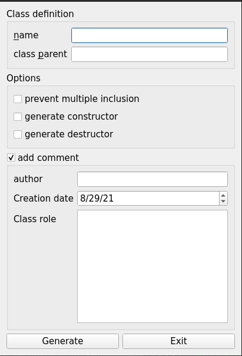
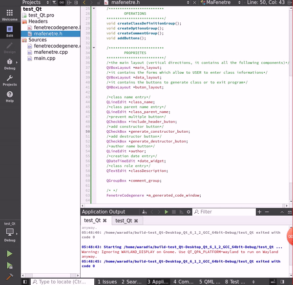
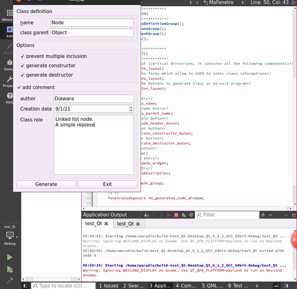

# Class generator.
An application with a graphical interface wich allow to an user to generate the prototype of a class.

# Technologies
- C++: object-oriented programming langage.
- Qt: A graphic library.

# User
## Installation

## Use
To generate a class, you have to:
- Give following informations:
  - name: the class name
  - class parent: does your class inherit from another ? Give the name of class parent, this one is optional. Leaving it empty means your class
- choose following options
You can choice to prevente or not multiple inclusion, to include the constructor and destrucor, or the documentation.

### Result:
Now the prototype of your class is generated, you can copy it.
Good coding.

